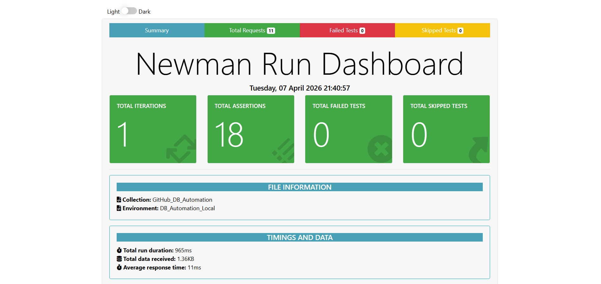

# 🗄️ Database Automation & Integrity Framework

[](#)
[](https://www.postman.com/)
[](https://nodejs.org/)
[](https://www.mysql.com/)

## 🚀 Overview
Standard API testing often stops at HTTP status codes, leaving the data layer unverified. This framework bridges that gap. By engineering a custom **Node.js Express Middleware**, I enabled **Postman** to execute direct, automated SQL assertions against a **MySQL** persistence layer.

This ensures that data is not just "received" by the API, but correctly stored, formatted, and secured within the physical database.

---

## 📊 Execution Summary


*The framework achieved a 100% pass rate across 11 requests and 18 assertions, covering schema, mapping, persistence, and security.*

---

## 📂 Project Structure
```text
GitHub_DB_Automation/
├── 📁 collections/        # Postman Collection JSON (Requests & Tests)
├── 📁 environments/       # Environment variables (bridge_url, db_creds)
├── 📁 scripts/            # Node.js Express Bridge & dependencies
├── 📁 sql/                # SQL scripts for Table & Schema setup
├── 📁 reports/            # Execution Dashboards & summary.png
└── README.md              # Project Documentation
```
--- 

## 🧪 Automated Test Specification

### **01. Schema Validation**
Validates the "Skeleton" of the database to ensure it matches the technical specification.
* **Assertions:** Data Types (`VARCHAR`, `INT`, `ENUM`), Primary Key integrity, and `auto_increment` functionality.

### **02. Data Mapping**
Performs "Back-to-Back" testing to ensure API payloads match SQL records.
* **Assertions:** Exact-match field verification, **Regex-based** email pattern matching, and **Temporal Logic** for timestamp freshness.

### **03. CRUD Persistence**
Automates the verification of permanent state changes.
* **Assertions:** Before vs. After row count tracking (`Count_After = Count_Before + 1`) and `affectedRows` metadata validation.
* **Cleanup:** Includes an idempotent teardown script to purge transient test data while protecting baseline records.

### **04. Constraint & Security (Negative Testing)**
Verified that the database acts as the final line of defense against malformed data.
* **Assertions:** Deliberately triggered and verified `ER_DUP_ENTRY` (Unique Constraint) and `ER_NO_DEFAULT_FOR_FIELD` (Null Constraint).

---

## 🛠️ Installation & Setup

1. **Clone the repository:**
   ```bash
   git clone [https://github.com/yourusername/postman-mysql-automation.git](https://github.com/yourusername/postman-mysql-automation.git)
   ```
2. **Setup the Database:**

* Execute the script found in /sql/setup_table.sql within your MySQL Workbench or preferred SQL environment to establish the required schema.

3. **Start the Middleware Bridge:**

* Navigate to the scripts directory and initialize the Node.js server:
 ```bash
cd scripts
npm install
node server.js
```
4. **Run via Newman (CLI):**

* Execute the automated collection and generate an htmlextra report using the following command:

``` Bash
newman run collections/DB_Automation.json -e environments/Env.json -r htmlextra
```
